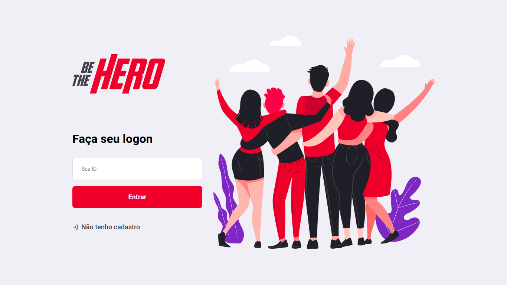

<!-- Project Logo -->

<!-- Project Shields -->

[![NPM Version][npm-image]][npm-url]
[![NodeJS][node-image]][node-url]
[![React][react-image]][react-url]
[![Knex][knex-image]][knex-url]
[![Rocketseat][rocketseat-image]][rocketseat-url]

<!-- Name of Project -->

# Be The Hero

<!-- Description -->

Aplicação para que ONG's possam encontrar Heros dispostos a ajudar casos de animais que sofreram algum tipo de maus tratos.

<!-- Table of Contents -->

## Tabela de Conteúdo

- [Tabela de Conteúdo](#tabela-de-conteúdo)
- [Sobre o Projeto](#sobre-o-projeto)
- [Tecnologias](#tec)
- [Layout](#layout)
- [Contribuição](#como-contribuir)
- [Instrutor](#instrutor)
- [Licença](#licença)

<!-- About The Project -->

## Sobre o projeto

O objetivo desta aplicação é proporcionar um espaço onde ONG's possam cadastrar casos de animais que sofreram algum tipo de abuso para que possam encontrar qualquer pessoa disposta a ajudar monetariamente, podendo assim salvar o dia. Deste modo nasceu o Be The Hero.

## :rocket: Tecnologias 

Esse projeto foi desenvolvido com as seguintes tecnologias:

- [Node.js](https://nodejs.org/en/)
- [React](https://reactjs.org)

## 🔖 Layout 

## 🤔 Como contribuir 

- Faça um fork desse repositório;
- Cria uma branch com a sua feature: `git checkout -b minha-feature`;
- Faça commit das suas alterações: `git commit -m 'feat: Minha nova feature'`;
- Faça push para a sua branch: `git push origin minha-feature`.

Depois que o merge da sua pull request for feito, você pode deletar a sua branch.

## :mortar_board: Instrutor 

A semana foi ministrada pelo [Diego Fernandes](https://github.com/diego3g)

## :memo: Licença 

Esse projeto está sob a licença MIT. Veja o arquivo [LICENSE](LICENSE.md) para mais detalhes.

<!-- Project Shields -->

[rocketseat-image]: https://img.shields.io/badge/made%20by-Rocketseat-%237e27c5
[rocketseat-url]: https://rocketseat.com.br/
[npm-image]: https://img.shields.io/badge/npm-v6.14.4-blue
[npm-url]: https://www.npmjs.com/
[node-image]: https://img.shields.io/badge/NodeJs-V12.16.2-%23007b00
[node-url]: https://nodejs.org/en/
[react-image]: https://img.shields.io/badge/-React-%2337dbff
[react-url]: https://pt-br.reactjs.org/
[knex-image]: https://img.shields.io/badge/-Knex-%23ee5400
[knex-url]: http://knexjs.org/